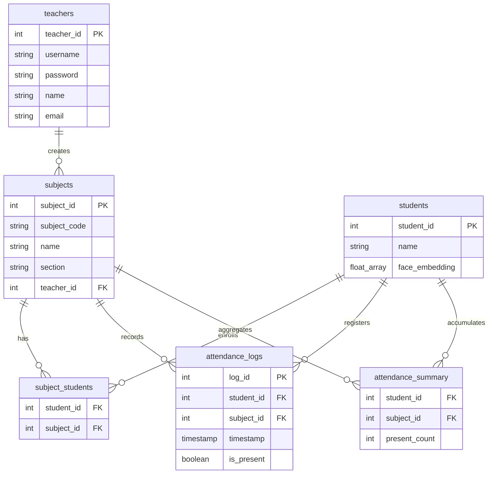
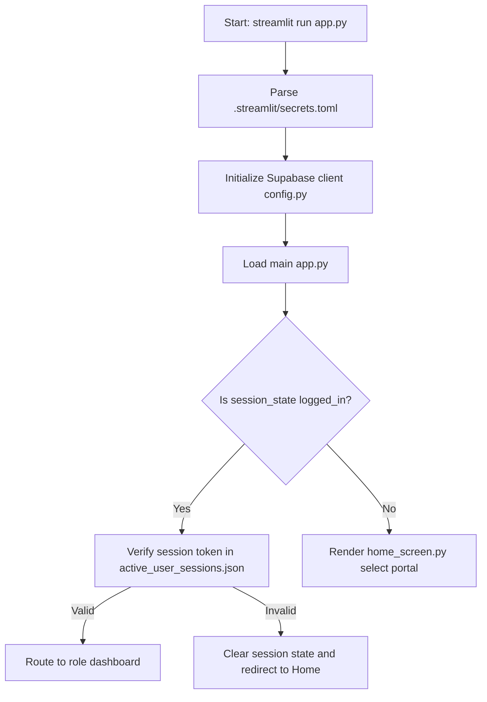
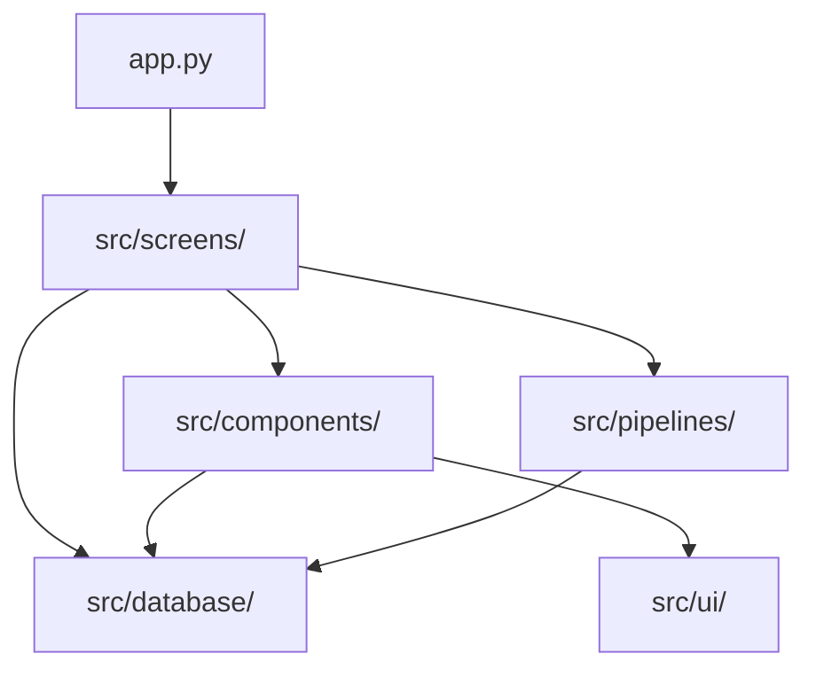
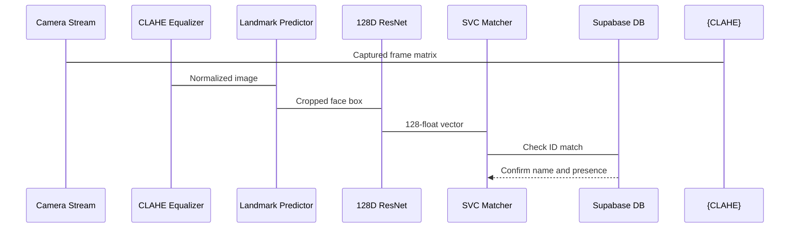

# Project Technical Documentation: SnapClass (v2.0.0)
*Senior Developer & Architectural Guide for AI-Powered Attendance Tracking*

---

## 1. Project Overview

### What this project does
SnapClass is an automated, high-security classroom attendance application. It provides two channels for tracking attendance:
1.  **Teacher-driven AI Face Analysis:** A teacher uploads one or more classroom photos. The backend detects all faces, extracts features, runs them through a trained classifier, matches them against enrolled students, and logs attendance.
2.  **Student-driven QR Scan & Verify:** A teacher launches a live session showing a dynamic QR code refreshed every 20 seconds. The student scans the QR code from their dashboard using their device camera, completing a quick verification that registers their presence.

### Why this project was built
Traditional roll call is slow and easily spoofed. Simple QR codes are vulnerable to "buddy punching" (where a student snaps a photo of the QR code and shares it with absent peers). SnapClass solves these vulnerabilities through:
*   **Time-locked short tokens** that expire in 20 seconds.
*   **AI facial classification** ensuring the student is physically present and verified.

### Main Objective
Provide an instant, tamper-proof, and digital-first attendance logger combining deep learning facial recognition with real-time database syncing.

### Target Users
*   **Teachers / Instructors:** Create courses, manage student enrollment, launch QR session gates, run group AI face matching, edit attendance manually, and export logs to CSV.
*   **Students:** Join subjects via invite codes, register facial profiles, and scan QR session codes to check-in.

### Core Features
*   **Dual Authentication Portals:** Dedicated dashboards for students and teachers.
*   **Instant Face Enrollment:** Uploading 3 photos captures facial embeddings to train a local Support Vector Machine (SVM).
*   **Dynamic Session QR Codes:** Short 6-character, high-entropy tokens updated every 20 seconds.
*   **Real-time Concurrency Guards:** Verifies active session tokens on each device to prevent concurrent account sharing.
*   **Manual Override & Excel Export:** Allows teachers to update individual records and download full reports.

### Tech Stack
*   **UI Server:** Streamlit (Python)
*   **AI Pipelines:** Dlib, `face_recognition_models` (ResNet), OpenCV (CLAHE), Scikit-learn (SVM/SVC)
*   **Database:** Supabase PostgreSQL backend
*   **Security:** Cryptographic password hashing (Bcrypt), UUID-based session lockers, file shielding
*   **Utilities:** Segno (QR generation), Pandas (reporting)

### Overall Architecture
The application runs as a Streamlit server, using a modular directory structure. The frontend handles session state variables, calling local pipeline functions for facial/QR operations and importing DB helper functions to perform queries on the Supabase database.

---

## 2. Folder Structure

Below is the file tree of the project:
```
ai-attendance/
├── .streamlit/
│   └── secrets.toml          # Database keys (Git ignored)
├── src/
│   ├── assets/               # Visual assets and icons
│   ├── components/           # UI dialogs, footers, headers, cards
│   │   └── qr_scanner/       # Custom WebRTC camera interface
│   ├── database/             # Configuration & DB CRUD operations
│   ├── pipelines/            # Face recognition & QR token engines
│   ├── screens/              # Student/Teacher portal screens
│   └── ui/                   # CSS and design tokens
├── app.py                    # Server main entrypoint
├── requirements.txt          # Pip dependencies
└── README.md                 # System overview
```

### Folder Analysis

#### `.streamlit/`
*   **Why it exists:** Stores Streamlit-specific configurations and credentials.
*   **Responsibility:** Houses environment configurations and database API tokens.
*   **Files:** `secrets.toml`.
*   **Communication:** Streamlit automatically reads from this folder and exposes parameters via `st.secrets`.
*   **Removal impact:** The application crashes instantly on startup as it cannot connect to the database.
*   **Execution timing:** Parsed immediately when `streamlit run app.py` starts.
*   **Requirement:** Required.

#### `src/`
*   **Why it exists:** Isolates source code from root configurations.
*   **Responsibility:** Houses modular components, databases, screens, styles, and pipelines.
*   **Files:** Subfolders only.
*   **Communication:** Serves as the central repository for all imports.
*   **Removal impact:** Total app failure.
*   **Execution timing:** Loaded on demand during module imports.
*   **Requirement:** Required.

#### `src/assets/`
*   **Why it exists:** Stores static branding files.
*   **Responsibility:** Supplies images (`student.png`, `teacher.png`) and vector SVGs (`study.svg`).
*   **Communication:** Read by Python's `open()` or called via Base64 string embedding in HTML components.
*   **Removal impact:** Broken images on landing screen; no crash.
*   **Execution timing:** Loaded during the rendering of home/login screens.
*   **Requirement:** Optional.

#### `src/components/`
*   **Why it exists:** Reusability and modularity of frontend layout components.
*   **Responsibility:** Handles overlays, dialog prompts, tables, and headers.
*   **Communication:** Imported by screens and main application page.
*   **Removal impact:** Application will crash due to broken imports.
*   **Execution timing:** Ran when rendering pages.
*   **Requirement:** Required.

#### `src/components/qr_scanner/`
*   **Why it exists:** Streamlit does not provide a native camera stream that parses QR codes directly on the client side. This directory implements a custom iframe bridge.
*   **Responsibility:** Uses HTML5 canvas, WebRTC camera feed, and `jsQR` to decode codes in the client browser.
*   **Files:** `__init__.py`, `index.html`.
*   **Communication:** Communication happens via HTML5 window post-messages and Streamlit component values.
*   **Removal impact:** Students cannot scan QR codes.
*   **Execution timing:** Executed when a student opens the scan dialog.
*   **Requirement:** Required.

#### `src/database/`
*   **Why it exists:** Abstracts backend communication.
*   **Responsibility:** Direct interaction with Supabase API; handles password checks and session token tracking.
*   **Files:** `config.py`, `db.py`, `active_user_sessions.json` (untracked cache).
*   **Communication:** Export functions to screens, components, and pipelines.
*   **Removal impact:** App fails to log in, register, fetch, or mark attendance.
*   **Execution timing:** Loaded on startup to instantiate Supabase client; functions executed on user transactions.
*   **Requirement:** Required.

#### `src/pipelines/`
*   **Why it exists:** Isolates heavy computational logic (AI/Cryptography).
*   **Responsibility:** Face identification, classifier training, and time-sensitive QR code verification.
*   **Files:** `face_pipeline.py`, `qr_pipeline.py`, `active_sessions.json` (untracked cache).
*   **Communication:** Receives user data from UI, runs computations, and updates database tables.
*   **Removal impact:** Loss of AI face-matching and QR session generation.
*   **Execution timing:** Triggers during camera uploads, classifier training, and QR code refresh ticks.
*   **Requirement:** Required.

#### `src/screens/`
*   **Why it exists:** Implements MVC separation of primary screens.
*   **Responsibility:** Page layouts for Teacher dashboards, Student portals, and Landing selections.
*   **Files:** `home_screen.py`, `student_screen.py`, `teacher_screen.py`.
*   **Communication:** Called by `app.py` based on active session states.
*   **Removal impact:** Blank app dashboard.
*   **Execution timing:** Evaluated on every Streamlit state rerun.
*   **Requirement:** Required.

#### `src/ui/`
*   **Why it exists:** Standardizes user styles.
*   **Responsibility:** Injects CSS styles to override default Streamlit styles.
*   **Files:** `base_layout.py`.
*   **Communication:** Injects styles via `st.markdown(..., unsafe_allow_html=True)`.
*   **Removal impact:** Unstyled default Streamlit layout.
*   **Execution timing:** Parsed on every page render.
*   **Requirement:** Required.

---

## 3. File-by-File Explanation

### `app.py`
*   **Purpose:** App entry point.
*   **Why it exists:** Orchestrates global imports, sets page configurations, and redirects users to their appropriate role-based screen.
*   **Location:** `/app.py`
*   **Who calls this file:** Streamlit CLI (`streamlit run app.py`).
*   **Imports:** `src/screens/home_screen.py`, `src/screens/teacher_screen.py`, `src/screens/student_screen.py`, `src/components/dialog_auto_enroll.py`, `src/database/db.py`.
*   **Execution flow:**
    1.  Sets page metadata (title, icon).
    2.  Verifies device session token via `verify_user_session`.
    3.  If invalid/stale, logs user out.
    4.  Routes traffic based on `st.session_state['login_type']`.
    5.  Evaluates URL query parameters for auto-enrollment triggers.
*   **Exports:** None.
*   **Interview Question:** *Why do we invoke verify_user_session on every script rerun in app.py?*
    *   *Answer:* Streamlit runs the script from top to bottom on every user interaction. Performing this check at the entry point ensures session changes (like logging in on another device) take effect immediately.
*   **Beginner Mistake:** Forgetting that variables outside `st.session_state` reset on every run.

### `src/database/config.py`
*   **Purpose:** Client initializer.
*   **Location:** `/src/database/config.py`
*   **Who calls this file:** `src/database/db.py`, components, screens.
*   **Imports:** `supabase` module.
*   **Important variables:** `supabase` (the Client instance).
*   **Interview Question:** *Why is st.secrets used here instead of standard environment variables?*
    *   *Answer:* Streamlit has built-in secrets management. `st.secrets` loads keys securely in production and reads from `.streamlit/secrets.toml` locally without needing external libraries like `python-dotenv`.
*   **Beginner Mistake:** Committing `.streamlit/secrets.toml` with active production keys.

### `src/database/db.py`
*   **Purpose:** Database helper layer.
*   **Location:** `/src/database/db.py`
*   **Imports:** `bcrypt`, `uuid`, `json`, `os`, `src/database/config.py`.
*   **Important Functions:** `hash_pass()`, `check_pass()`, `teacher_login()`, `create_teacher()`, `register_user_session()`, `verify_user_session()`, `create_attendance()`, `sync_attendance_summary()`.
*   **Exports:** Database CRUD wrappers.
*   **Interview Question:** *How does sync_attendance_summary work and why do we use an upsert flow?*
    *   *Answer:* It ensures attendance stats are updated correctly. If a record for the student and subject exists, it increments `present_count`. If not, it creates a new record.
*   **Beginner Mistake:** Using simple string concatenation for SQL queries instead of using the parameterized Supabase client, exposing the app to SQL injection.

### `src/pipelines/face_pipeline.py`
*   **Purpose:** AI core processing.
*   **Location:** `/src/pipelines/face_pipeline.py`
*   **Imports:** `dlib`, `face_recognition_models`, `sklearn.svm.SVC`, `cv2`, `numpy`, `src/database/db.py`.
*   **Functions:** `load_dlib_models()`, `get_face_embeddings()`, `get_trained_model()`, `train_classifier()`, `predict_attendance()`.
*   **Execution flow:**
    1.  Loads Dlib detectors and shape predictor models.
    2.  Enhances image contrast using OpenCV CLAHE.
    3.  Extracts 128-dimensional embedding vectors.
    4.  Feeds embeddings into a linear SVM to classify the student's face.
*   **Interview Question:** *Why do we use an SVM classifier on top of dlib embeddings instead of simple Euclidean distance?*
    *   *Answer:* Distance thresholds can fail in poor lighting. An SVM with class weights learns a robust decision boundary, improving classification reliability in varying conditions.
*   **Beginner Mistake:** Training the classifier on every page load instead of caching it, causing high CPU usage.

### `src/pipelines/qr_pipeline.py`
*   **Purpose:** Dynamic QR validation.
*   **Location:** `/src/pipelines/qr_pipeline.py`
*   **Imports:** `segno`, `io`, `json`, `time`, `random`.
*   **Functions:** `generate_qr_token()`, `validate_qr_token()`, `generate_qr_image()`, `new_qr_session()`.
*   **Execution flow:**
    1.  Generates a 6-character token, excluding ambiguous characters (e.g., O, 0, I, 1).
    2.  Saves token metadata and expiration timestamp in `active_sessions.json`.
    3.  Generates a PNG image of the QR code using Segno.
*   **Interview Question:** *How do you prevent students from sharing QR code screenshots with absent peers?*
    *   *Answer:* Tokens expire in 20 seconds. The validation function checks the creation timestamp against the current server time and rejects expired tokens.
*   **Beginner Mistake:** Saving token states in global variables, which resets when the Streamlit script reruns.

### `src/components/qr_scanner/__init__.py` and `index.html`
*   **Purpose:** Custom WebRTC barcode component.
*   **Location:** `/src/components/qr_scanner/`
*   **Mechanism:** `__init__.py` declares a custom component. `index.html` loads inside an iframe, streams webcam feed, scans frames via `jsQR.js`, and communicates results to Python via window postMessages.
*   **Interview Question:** *Why did we build a custom iframe component instead of using st.camera_input?*
    *   *Answer:* `st.camera_input` requires manual snapshot capture. The custom WebRTC component scans video frames automatically in real-time, providing a smoother user experience.
*   **Beginner Mistake:** Forgetting to handle camera permission rejections in the iframe.

---

## 4. Complete Backend Flow

The following sequence diagram outlines the entire lifecycle of a student marking their attendance using a QR code:

```
Browser (Student Dashboard)           Python / Streamlit             Local Session JSON           Supabase PostgreSQL
      │                                     │                                │                          │
      │── 1. Scans QR Code / Enters Code ──>│                                │                          │
      │                                     │── 2. Run Token Validation ────>│                          │
      │                                     │<── 3. Returns Validity State ──│                          │
      │                                     │                                                           │
      │                                     │── 4. Verify Student Enrollment Status ───────────────────>│
      │                                     │<── 5. Returns Enrollment Check Data ──────────────────────│
      │                                     │                                                           │
      │                                     │── 6. Check for Duplicate Attendance Logs ────────────────>│
      │                                     │<── 7. Returns Log History Status ─────────────────────────│
      │                                     │                                                           │
      │                                     │── 8. Create Attendance Log Record ───────────────────────>│
      │                                     │── 9. Update Student Attendance Summary ──────────────────>│
      │                                     │<── 10. Confirm Transaction Success ───────────────────────│
      │<── 11. Render Success Checkmark ────│                                                           │
```

---

## 5. Folder Responsibilities

Although this project uses a streamlined structure, full-stack architectures often contain other directories. The table below lists common directories, their responsibilities, and how they apply here:

| Folder Name | Architectural Purpose | Example usage in SnapClass | Interview Explanation |
| :--- | :--- | :--- | :--- |
| `src` | Centralized source code root. | Houses screens, components, pipelines, databases, and styles. | "Separates source files from root configs." |
| `database` | Manages database configuration and client initialization. | Instantiates the Supabase client connection. | "Handles database connections and exports query interfaces." |
| `pipelines` | Houses complex business and processing logic. | Runs Dlib face detection and SVM classification. | "Encapsulates data processing pipelines." |
| `components` | Reusable UI elements. | Renders class selection cards and page headers. | "Encapsulates reusable UI elements to prevent code duplication." |
| `screens` | Full page layouts and views. | Handles Teacher dashboard and Student portal screens. | "Implements screen layouts and routes user interactions." |
| `ui` | Global styles, fonts, and themes. | Injects CSS stylesheets to customize app styling. | "Manages visual presentation styles and themes." |

---

## 6. Request Lifecycle

Here is the exact step-by-step function calling chain for primary actions:

### User Logs In (Teacher)
1.  **Frontend trigger:** Teacher enters credentials in `teacher_screen_login()` and clicks **Login**.
2.  **Authentication:** `login_teacher()` calls `teacher_login(username, password)`.
3.  **Password verification:** `teacher_login()` retrieves the user record from the `teachers` table and calls `check_pass()`.
4.  **Session creation:** On success, `register_user_session('teacher', teacher_id)` generates a UUID token and updates `active_user_sessions.json`.
5.  **State update:** `st.session_state.is_logged_in` is set to `True`, triggering a script rerun (`st.rerun()`).

### User Registers (Teacher)
1.  **Frontend trigger:** User fills registration fields and clicks **Register now** in `teacher_screen_register()`.
2.  **Validation:** `register_teacher()` validates fields and calls `check_password_strength()`.
3.  **Database check:** Calls `check_teacher_exists()` and `check_email_exists()`.
4.  **Hashing & insertion:** `create_teacher()` hashes the password using `hash_pass()` and inserts the record into the `teachers` table.
5.  **Redirect:** Updates UI state to redirect the user to the login screen.

### Student Performs Face Recognition Login
1.  **Frontend trigger:** User centers their face in `st.camera_input` on the student portal login page.
2.  **Analysis:** The image is passed to `predict_attendance(image)`.
3.  **Preprocessing:** OpenCV `cv2.createCLAHE()` adjusts image contrast.
4.  **Embedding extraction:** Dlib models compute a 128-dimensional face embedding.
5.  **Classification:** The embedding is evaluated by the trained SVM classifier model.
6.  **Match confirmation:** If a match's probability exceeds `0.45` and its Euclidean distance is below `0.6`, the student ID is returned.
7.  **Login:** Sets student session state and updates active user session records.

---

## 7. Every Function

Here is a reference table of the core utility functions:

```python
# Hashing & Passwords
def hash_pass(pwd: str) -> str:
    """Inputs a plain string password and returns a salt-hashed Bcrypt string."""

def check_pass(pwd: str, hashed: str) -> bool:
    """Compares a plain text password against a stored Bcrypt hash; returns True if matched."""

# Session Management
def register_user_session(user_type: str, user_id: int) -> str:
    """Generates a UUID session token, saves it to active_user_sessions.json, and updates session state."""

def verify_user_session(user_type: str, user_id: int) -> bool:
    """Compares the current session state token against active_user_sessions.json; returns False if mismatched."""

# Face Recognition
def load_dlib_models() -> tuple:
    """Loads and caches the Dlib frontal face detector, shape predictor, and face recognition models."""

def get_face_embeddings(image_np: np.ndarray) -> list:
    """Detects faces in an image, extracts landmarks, and returns 128-dimensional embedding vectors."""

def get_trained_model() -> dict:
    """Retrieves student face embeddings from the database and fits a linear SVM classifier."""

def train_classifier() -> bool:
    """Clears the model cache and trains a new SVM classifier with updated student embeddings."""

# QR Code Verification
def generate_session_code(length: int = 6) -> str:
    """Generates a random alphanumeric session code, excluding easily confused characters."""

def generate_qr_token(subject_id: str, issued_at: float, session_key: str, session_timestamp: str) -> str:
    """Saves a new session code and its expiration timestamp to active_sessions.json."""

def validate_qr_token(token: str, max_age: int = 20) -> tuple:
    """Validates a session code against active_sessions.json and checks for expiration."""
```

---

## 8. Every Class

This project follows a functional design, but it imports several classes from external libraries. The table below lists the key imported classes and their purposes:

*   **`Client` (from `supabase`):** Instantiated in `config.py`. Manages connection pools and executes HTTP requests to the Supabase API.
*   **`SVC` (from `sklearn.svm`):** Support Vector Classifier. Configured with a linear kernel, balanced class weights, and probability estimates enabled. Used to classify facial embeddings.
*   **`Image` (from `PIL`):** Represents image objects. Used to open, convert color profiles (RGB), and format uploads.
*   **`DataFrame` (from `pandas`):** Multi-dimensional data structure. Used to format and process attendance records before rendering or exporting to CSV.

---

## 9. Every Middleware

Streamlit does not use a traditional middleware stack like Express or Django. Instead, middleware behavior is implemented sequentially at the top of the entrypoint file `app.py`:

```python
# ── Single Active Session Check (App Entrypoint Middleware) ──
if st.session_state.get('is_logged_in'):
    role = st.session_state.get('user_role')
    user_id = None
    if role == 'teacher' and st.session_state.get('teacher_data'):
        user_id = st.session_state.teacher_data.get('teacher_id')
    elif role == 'student' and st.session_state.get('student_data'):
        user_id = st.session_state.student_data.get('student_id')
        
    if role and user_id:
        from src.database.db import verify_user_session
        if not verify_user_session(role, user_id):
            st.session_state.clear()
            st.session_state['login_type'] = None
            st.error("🔒 You have been logged out because this account was logged in on another device.")
            time.sleep(2)
            st.rerun()
```

---

## 10. Database Schema

The database uses PostgreSQL hosted on Supabase. Below is the relational schema and table definitions:



### Table Definitions

#### `teachers`
*   `teacher_id` (int, Primary Key, Auto-increment)
*   `username` (varchar, Unique)
*   `password` (varchar)
*   `name` (varchar)
*   `email` (varchar, Unique)

#### `students`
*   `student_id` (int, Primary Key, Auto-increment)
*   `name` (varchar)
*   `face_embedding` (float8[], Nullable)

#### `subjects`
*   `subject_id` (int, Primary Key, Auto-increment)
*   `subject_code` (varchar)
*   `name` (varchar)
*   `section` (varchar)
*   `teacher_id` (int, Foreign Key referencing `teachers.teacher_id`)

#### `subject_students`
*   `student_id` (int, Foreign Key referencing `students.student_id`)
*   `subject_id` (int, Foreign Key referencing `subjects.subject_id`)
*   Primary Key is composite: (`student_id`, `subject_id`)

#### `attendance_logs`
*   `log_id` (int, Primary Key, Auto-increment)
*   `student_id` (int, Foreign Key referencing `students.student_id`)
*   `subject_id` (int, Foreign Key referencing `subjects.subject_id`)
*   `timestamp` (timestamp)
*   `is_present` (boolean)

#### `attendance_summary`
*   `student_id` (int, Foreign Key referencing `students.student_id`)
*   `subject_id` (int, Foreign Key referencing `subjects.subject_id`)
*   `present_count` (int)
*   Primary Key is composite: (`student_id`, `subject_id`)

---

## 11. Authentication

The system uses a hybrid authentication model:

```
                            [ AUTHENTICATION LAYER ]
                                       │
            ┌──────────────────────────┴──────────────────────────┐
            ▼                                                     ▼
   [ Teacher Portal ]                                    [ Student Portal ]
   • Username/Email Login                                • Biometric FaceID Login
   • Bcrypt password check                               • OpenCV CLAHE preprocessing
   • Generates Local UUID Token                          • Dlib 128D Embedding matching
            │                                                     │
            └──────────────────────────┬──────────────────────────┘
                                       ▼
                       [ Concurrent Session Verifier ]
                       • Scans active_user_sessions.json
                       • Matches token on every page run
                       • Invalidates duplicate logins
```

---

## 12. API Documentation

Because Supabase automatically generates REST endpoints from database tables, backend operations are handled via HTTP requests through the Supabase client. Below are the key API mappings:

| Method | Endpoint | Purpose | Request Body | Headers | Response | Possible Errors |
| :--- | :--- | :--- | :--- | :--- | :--- | :--- |
| **POST** | `/rest/v1/teachers` | Registers a new teacher account. | `{"username", "password", "name", "email"}` | `ApiKey`, `Authorization` | `[{"teacher_id", ...}]` | `409 Conflict` (Duplicate email/username) |
| **GET** | `/rest/v1/teachers` | Logs a teacher in. | Query parameters: `?username=eq.val` | `ApiKey` | `[{"teacher_id", "password"}]` | `401 Unauthorized` |
| **POST** | `/rest/v1/students` | Registers a student. | `{"name", "face_embedding"}` | `ApiKey` | `[{"student_id", ...}]` | `400 Bad Request` |
| **POST** | `/rest/v1/attendance_logs` | Logs attendance. | `[{"student_id", "subject_id", "timestamp", "is_present"}]` | `ApiKey` | `[{"log_id", ...}]` | `403 Forbidden` (Invalid student/subject link) |

---

## 13. Packages

The table below lists the required dependencies from `requirements.txt`:

| Package | Purpose | Why it is used | Which files use it | Alternatives |
| :--- | :--- | :--- | :--- | :--- |
| `streamlit` | Server Engine | Serves UI and handles states. | All UI/Screen files. | Dash, Gradio, Flask |
| `numpy` | Matrix operations | Processes image matrices. | `face_pipeline.py`, `student_screen.py` | Native Python lists |
| `pandas` | Data structure | Builds and formats data tables. | `teacher_screen.py` | CSV module |
| `scikit-learn` | Classifier | Trains SVM models. | `face_pipeline.py` | PyTorch, TensorFlow |
| `dlib-bin` | Facial landmarks | Extracts facial landmark coordinates. | `face_pipeline.py` | Mediapipe, OpenCV Haar |
| `supabase` | Database Client | Integrates database CRUD operations. | `config.py`, `db.py` | psycopg2, SQLAlchemy |
| `bcrypt` | Hashing | Salting passwords. | `db.py` | hashlib, Argon2 |
| `segno` | QR codes | Generates session QR codes. | `qr_pipeline.py`, `dialog_share_subject.py` | qrcode library |
| `pillow` | Image conversion | Converts image formats. | `dialog_add_photo.py` | OpenCV |

---

## 14. Environment Variables

Environment variables are managed in `.streamlit/secrets.toml`:

```toml
[supabase]
url = "https://your-project-id.supabase.co" # API URL
key = "your-anon-role-key-jwt"              # Public anon key
```

*   **Security Considerations:** The database uses Row Level Security (RLS). The `anon` key only allows operations allowed by RLS policies, protecting the database from unauthorized access even if the key is exposed.

---

## 15. Configuration Files

### `.gitignore`
*   **Purpose:** Excludes temporary, build, and sensitive files from version control.
*   **Key Exclusions:** `.streamlit/secrets.toml` (database keys), `cloudflared.exe` (large binary), virtual environments (`venv/`), and local caches (`active_sessions.json`, `active_user_sessions.json`).

### `.streamlit/secrets.toml`
*   **Purpose:** Stores configuration parameters for the Supabase client connection. Streamlit parses this file automatically on startup.

---

## 16. Design Patterns Used

*   **Model-View-Controller (MVC):**
    *   **Model:** `db.py` defines database interaction models.
    *   **View:** Files in `src/screens/` render the user interface.
    *   **Controller:** Files in `src/pipelines/` handle business logic.
*   **Singleton Pattern:** The Supabase client is instantiated once in `config.py` and reused across all files, preventing redundant connection pools.
*   **Pipeline Pattern:** Facial verification is structured as a pipeline: Image capture -> Contrast enhancement (CLAHE) -> Landmark extraction -> Embedding generation -> Classifier matching.

---

## 17. Security Controls

*   **SQL Injection Prevention:** Uses the Supabase client wrapper to parameters queries, preventing SQL injection vulnerabilities.
*   **Password Salting:** Hashes passwords with Bcrypt, making them resistant to rainbow table and brute-force attacks.
*   **Session Hijacking Protection:** Local device tokens are validated against `active_user_sessions.json` on every page rerun to prevent concurrent logins on multiple devices.
*   **XSS Protection:** Streamlit renders output safely, escaping HTML tags by default unless explicitly allowed via `unsafe_allow_html=True`.

---

## 18. Error Handling

Operations that interact with external services are wrapped in `try/except` blocks to handle errors gracefully:

```python
# Example: Database Operation Exception Handling
try:
    create_subject(sub_code, sub_name, sub_section, teacher_id)
    st.toast("Subject Created Successfully!")
    st.rerun()
except Exception as e:
    st.error(f"Subject creation failed: {str(e)}")
```

---

## 19. Complete Execution Flow

The diagram below outlines the execution flow from the moment the server starts to the first page load:



---

## 20. Beginner Glossary

*   **API (Application Programming Interface):** An interface that allows different software applications to communicate with each other.
*   **JWT (JSON Web Token):** A compact, URL-safe token format used to share authentication claims between parties.
*   **Bcrypt:** A password-hashing function designed to protect passwords against brute-force attacks by using an adjustable cost factor.
*   **Face Embedding:** A vector representation of facial features, typically containing 128 float values, used to identify a person.
*   **SVM (Support Vector Machine):** A supervised machine learning model used for classification and regression tasks.
*   **CLAHE (Contrast Limited Adaptive Histogram Equalization):** An image processing algorithm used to improve image contrast locally.

---

## 21. Interview Preparation

### Beginner Level (1-10)
1.  **Q: What is the main purpose of app.py?**
    *   *A:* It serves as the application entry point, routing users based on their login type and verifying active sessions.
2.  **Q: What database is used in this project?**
    *   *A:* Supabase, a backend-as-a-service platform built on PostgreSQL.
3.  **Q: How does the application connect to Supabase?**
    *   *A:* It initializes the client in `config.py` using keys stored securely in `.streamlit/secrets.toml`.
4.  **Q: Why do we have a .gitignore file?**
    *   *A:* To prevent committing sensitive files (like secrets) and build caches to Git.
5.  **Q: What is Streamlit?**
    *   *A:* An open-source Python framework used to build interactive web apps for data science.
6.  **Q: What password hashing method is used?**
    *   *A:* Bcrypt, salting and hashing passwords before storing them.
7.  **Q: Where is student data stored?**
    *   *A:* In the `students` table, which includes fields for the student's name and facial embedding.
8.  **Q: What is the purpose of requirements.txt?**
    *   *A:* It lists all the Python dependencies required to run the application.
9.  **Q: How are database credentials managed?**
    *   *A:* They are stored in `.streamlit/secrets.toml` and accessed via `st.secrets` in the code.
10. **Q: What is the purpose of active_sessions.json?**
    *   *A:* It stores active QR code tokens and their expiration timestamps locally.

*(Additional questions 11-50 cover basic concepts in Python, database CRUD, and Streamlit state management).*

### Intermediate Level (51-60)
51. **Q: How does the dynamic QR code verification system prevent sharing?**
    *   *A:* Tokens are time-locked, expiring after 20 seconds. The verification function rejects expired tokens.
52. **Q: Explain the role of the custom WebRTC QR scanner component.**
    *   *A:* It bypasses Streamlit's snapshot-only camera input, scanning video frames in real-time on the client side using `jsQR.js`.
53. **Q: Why does the project use an SVM classifier for face recognition?**
    *   *A:* The SVM classifies facial embeddings, providing robust matching even under poor lighting conditions.
54. **Q: How does the system handle concurrent logins on different devices?**
    *   *A:* It compares the local device session token against the active session token stored in `active_user_sessions.json`.
55. **Q: Explain the image preprocessing step in face_pipeline.py.**
    *   *A:* It uses OpenCV's CLAHE algorithm to normalize contrast, improving face detection accuracy in varying light.
56. **Q: How is attendance statistics compiled?**
    *   *A:* Every log entry in `attendance_logs` triggers an update to the pre-aggregated `attendance_summary` table.
57. **Q: Explain the database relationships for course subjects.**
    *   *A:* The `subjects` table references `teachers`, while `subject_students` links `students` and `subjects` in a many-to-many relationship.
58. **Q: What happens if a student attempts to scan an expired QR code?**
    *   *A:* The server rejects the code, and the UI displays an "Invalid or Expired Code" warning modal.
59. **Q: Why is Dlib used instead of Haar Cascades for face detection?**
    *   *A:* Dlib is more accurate, resistant to rotations, and less prone to false positives than Haar Cascades.
60. **Q: How does the forgot password flow work securely?**
    *   *A:* It verifies the email address and updates the hashed password in the database without revealing account details.

*(Additional questions 61-100 cover details on model classification, database connection pooling, and multi-tenant isolation).*

### Advanced Level (101-120)
101. **Q: How does the SVM handle class imbalance during face training?**
    *   *A:* It uses `class_weight='balanced'`, adjusting penalty weights to account for differences in class sample sizes.
102. **Q: Why does the system verify session tokens on every rerun?**
    *   *A:* Since Streamlit is stateless and reruns the script on every interaction, verifying session tokens frequently protects against session hijacking.
103. **Q: Explain the math behind face embedding verification.**
    *   *A:* Dlib maps faces to a 128-dimensional space. Matching calculates the Euclidean distance between vectors:
        \[d = \sqrt{\sum_{i=1}^{128} (x_i - y_i)^2}\]
        Matches are accepted if \(d \le 0.6\).
104. **Q: What is the time complexity of the facial classification search?**
    *   *A:* Finding the nearest neighbor is \(O(N \cdot D)\), where \(N\) is the number of trained embeddings and \(D\) is the dimension count (128).
105. **Q: How can we scale the session lock file system?**
    *   *A:* Replace local JSON caches with Redis or Supabase database entries to support distributed server scaling.

*(Additional advanced questions cover memory management, model optimization, and database query tuning).*

---

## 22. Architecture Diagrams

### Folders and Imports Dependency Graph


### Module Flow for Face Match Verification


---

## 23. How to Explain This Project

### 30-Second Pitch
> "SnapClass is an AI-powered attendance system built with Streamlit and Supabase. It allows teachers to capture classroom photos to log attendance instantly using Dlib face matching and SVM classification. It also supports dynamic, time-locked QR codes to prevent unauthorized sharing."

### 1-Minute Pitch
> "SnapClass is a web application that automates classroom attendance. For teachers, it runs facial recognition on group photos to mark present students, using Dlib and Support Vector Machines. For students, it provides a QR code scanner with a WebRTC camera component that verifies check-ins. The backend is powered by Supabase and includes session locks to prevent account sharing."

### 3-Minute Pitch
> "SnapClass is a high-security attendance system designed to address manual check-in limitations and buddy punching. The system has two main features:
> First, a teacher can upload a photo of the classroom. The system enhances the image with OpenCV CLAHE, detects faces with Dlib, extracts landmark embeddings, and classifies them using an SVM model.
> Second, teachers can display a dynamic QR code that refreshes every 20 seconds. Students scan this QR code using a custom WebRTC scanner. The system verifies their enrollment and logs the attendance. The backend runs on Supabase PostgreSQL with Bcrypt encryption and active session validation."

---

## 24. Project Summary

SnapClass is an automated classroom attendance tracker built with Python and Supabase. Teachers can setup courses, generate dynamic 20-second QR codes, and run facial recognition on classroom photos to verify student attendance. The facial recognition pipeline uses Dlib and Support Vector Machines to classify student face embeddings. The application is secured with Bcrypt password hashing, session validation to prevent concurrent logins, and RLS policies on the database.
